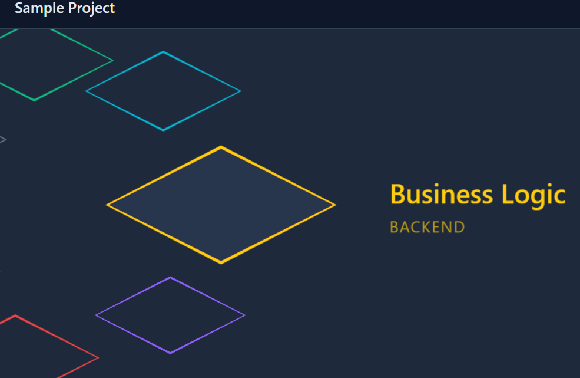
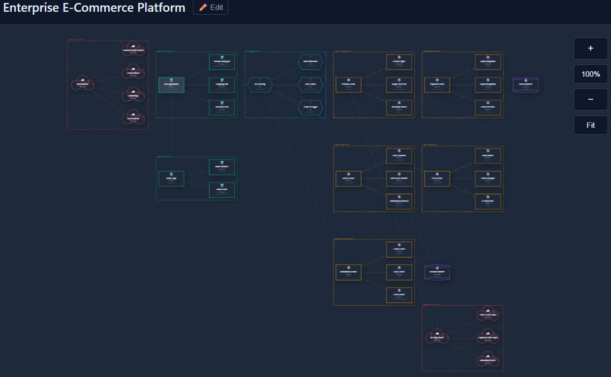

# ZTACK
## Tech Stack Visualizer and Organizer

[](https://oddzac.github.io/ztack)
[](LICENSE)

**ZTACK** is a modern, interactive web application for visualizing and organizing technology stacks. Built with vanilla JavaScript and HTML5 Canvas, it provides dual visualization modes: a high-level rotary carousel stack view and C4-style architecture diagrams with seamless real-time synchronization.




## 🚀 Live Demo

Visit the live application: [https://oddzac.github.io/ztack](https://oddzac.github.io/ztack)

## ✨ Features

### Current Features (v1.0)

#### 🎨 Dual Visualization Modes
- **Stack View**: Interactive 3D circular carousel with smooth animations
  - Infinite scroll navigation (keyboard & mouse wheel)
  - Diamond-shaped layer cards with color-coded borders
  - Vertical substack visualization
  - Real-time layer selection and editing
  - Floating action toolbar for layer operations

- **Diagram View**: C4-style architecture diagrams
  - Component-specific shapes (rectangles, cylinders, hexagons, clouds)
  - Visual icons for quick identification
  - Drag-and-drop node positioning
  - Connection arrows with visual distinction (layer vs substack connections)
  - Automatic collision detection and resolution
  - Topological layout respecting all dependencies
  - Click-to-edit functionality

#### 📊 Layer Management
- Create, edit, and delete layers
- Hierarchical substacks for detailed component breakdown
- Layer properties:
  - Name, Type, Status (Active/Inactive/Deprecated)
  - Technology stack
  - Description and responsibilities
  - Connections to other components
- Move layers up/down to reorder
- Substack management with parent-child relationships

#### 🔗 Relationship Mapping
- **Context-Aware Connections**:
  - Main layers connect to other main layers
  - Substacks connect to main layers, other substacks, or siblings
  - Automatic filtering prevents invalid connections
  - Visual distinction between layer-level and substack-level connections

- **Visual Connection Types**:
  - Layer-to-layer: Thicker lines, wider dashes, darker color
  - Substack connections: Thinner lines, tighter dashes, lighter color
  - Parent-child containment: Dotted lines (separate from connections)

- **Connection Search**:
  - Real-time search filtering
  - Case-insensitive partial matching
  - Connection count badge (e.g., "3/12")
  - Instant feedback as you type

#### 💾 Project Management
- **New**: Create fresh projects
- **Open**: Import JSON project files
- **Save**: Export projects as JSON
- Auto-save to browser localStorage
- Project statistics dashboard
- Undo/Redo functionality for all changes

#### 🎯 Professional Features
- Color-coded component types (Frontend, Backend, API, Database, DevOps, Core)
- C4 model compliance with proper visual notation
- **Tabbed Details Panel**:
  - Properties Tab: Layer editing and operations
  - Connections Tab: Search and relationship management
  - Substacks Tab: Substack list and creation
- Real-time synchronization between all views
- Collision detection prevents node overlaps
- Responsive layout adapts to panel width changes
- Smooth animations and transitions

#### ⌨️ Keyboard Navigation
- ↑/↓: Navigate through layers
- →: Enter substack
- ←: Exit substack
- Mouse wheel: Scroll through layers
- Drag nodes in diagram view to reposition

## 🛠️ Technology Stack

- **Frontend**: Vanilla JavaScript (ES6+)
- **Rendering**: HTML5 Canvas API
- **Styling**: CSS3 with custom properties
- **Data Format**: JSON
- **Deployment**: GitHub Pages (static hosting)
- **Storage**: Browser localStorage (client-side)

## 📦 Installation & Setup

### For GitHub Pages Deployment

1. Clone the repository:
```bash
git clone https://github.com/yourusername/ztack.git
cd ztack
```

2. The application is fully client-side and requires no build process. Simply open `index.html` in a browser or deploy to GitHub Pages.

3. To deploy to GitHub Pages:
   - Push to your repository
   - Go to Settings → Pages
   - Select branch and root folder
   - Your app will be live at `https://yourusername.github.io/ztack`

### Local Development

Simply open `index.html` in a modern web browser. No server required!

For live reload during development, use a simple HTTP server:
```bash
# Python 3
python -m http.server 8000

# Node.js
npx http-server
```

## 📖 Usage Guide

### Creating Your First Stack

1. **Add Layers**: Click "+ Add Layer" to create components
2. **Edit Details**: Select a layer to open the tabbed details panel
3. **Properties Tab**: Edit layer name, type, status, technology, description
4. **Connections Tab**: Search and select connections to other components
5. **Substacks Tab**: Add nested components within a layer
6. **Navigate**: Use arrow keys or scroll to move through layers
   - ↑/↓: Navigate main stack
   - →: Enter substack
   - ←: Exit substack

### Switching Views

- **View → Stack View**: 3D carousel visualization
- **View → Diagram View**: C4 architecture diagram
- Both views stay synchronized in real-time

### Layer Operations

- **Move Up/Down**: Reorder layers using toolbar buttons
- **Add Substack**: Create nested components (main layers only)
- **Delete**: Remove layers or substacks
- All operations available in floating toolbar or details panel

### Saving & Loading

- **File → Save**: Download project as JSON
- **File → Open**: Load existing project
- **File → New**: Start fresh project
- Auto-save to localStorage prevents data loss

## 🎯 Keyboard Shortcuts

| Key | Action |
|-----|--------|
| ↑/↓ | Navigate layers |
| ←/→ | Enter/exit substacks |
| Mouse Wheel | Scroll through layers |
| Drag (Diagram) | Reposition nodes |

## 🗺️ Roadmap

### Phase 1: Core Architecture (✅ Complete)
- [x] Dual visualization modes (Stack & Diagram)
- [x] Layer and substack management
- [x] Connection system with context awareness
- [x] Tabbed details panel
- [x] Connection search and filtering
- [x] Collision detection in diagram layout
- [x] Undo/redo functionality
- [x] localStorage persistence

### Phase 2: Enhanced Diagram Interactions (Planned)
- [ ] Double-click empty space to create new layer
- [ ] Right-click context menu (edit, delete, duplicate)
- [ ] Drag from node to node to create connections
- [x] Connection labels (HTTP, gRPC, Event Bus, etc.)
- [x] Connection type indicators (sync/async, request/response)
- [x] Hover over connection to see details
- [x] Zoom in/out controls
- [x] Auto-layout (organize nodes automatically)
~~- [ ] Grid snap for precise positioning~~

### Phase 3: Visual Enhancements (Planned)
- [x] Visual grouping boxes around substacks in diagram
- [ ] Breadcrumb navigation (Main > Layer > Substack)
- [ ] Mini-map for large architectures
- [ ] Preview thumbnails of substacks in main view
- [ ] Keyboard shortcut to jump to specific layer
- [ ] Bulk operations (select multiple, move together)

### Phase 4: Export & Documentation (Planned)
- [ ] Export diagrams to PNG/SVG
- [ ] Generate markdown documentation
- [ ] Export to PlantUML/Mermaid formats
- [ ] PDF report generation
- [ ] Version history/changelog tracking

### Phase 5: Enterprise Features (Planned)
- [ ] Cost tracking per component (AWS/Azure pricing integration)
- [ ] SLA/uptime requirements per layer
- [ ] Security compliance tags (SOC2, HIPAA, GDPR)
- [ ] Performance metrics (latency, throughput)
- [ ] Scalability indicators (horizontal/vertical scaling)
- [ ] Data flow annotations (PII, sensitive data paths)
- [ ] Risk assessment (single points of failure)
- [ ] Tech debt tracking

### Phase 6: Integration & Automation (Planned)
- [ ] Import from Terraform/CloudFormation
- [ ] Import from Docker Compose
- [ ] Auto-detect tech stack from GitHub repos
- [ ] CI/CD pipeline integration
- [ ] Infrastructure-as-code sync
- [ ] Dependency analysis and visualization
- [ ] Security vulnerability scanning
- [ ] Performance bottleneck identification

### Phase 7: Advanced Visualization (Planned)
- [ ] Full C4 model levels (Context, Container, Component, Code)
- [ ] Deployment view with physical infrastructure
- [ ] Data flow diagrams
- [ ] Sequence diagrams
- [ ] Network topology view (security zones, VPCs, subnets)
- [ ] Multiple diagram types per project

### Phase 8: Analysis & Insights (Planned)
- [ ] Circular dependency detection and warnings
- [ ] Cost optimization suggestions
- [ ] Architectural pattern recognition
- [ ] Compliance validation
- [ ] Performance analysis reports
- [ ] Tech stack recommendations

### Phase 9: Collaboration & Sharing (Cloud-Ready) (Planned)
- [ ] Cloud storage integration (AWS S3)
- [ ] User authentication (AWS Cognito)
- [ ] Team collaboration features
- [ ] Real-time co-editing with WebSocket sync
- [ ] Comments and annotations
- [ ] Share links (view-only or edit access)
- [ ] Access control and permissions (AWS IAM)
- [ ] Audit logging and change tracking
- [ ] Version history with rollback capability
- [ ] Conflict resolution for concurrent edits

### Phase 10: Templates & Standards (Planned)
- [ ] Pre-built architecture templates (microservices, monolith, serverless)
- [ ] Industry-specific templates (fintech, healthcare, e-commerce)
- [ ] Company-specific component libraries
- [ ] Compliance templates (PCI-DSS, HIPAA architectures)
- [ ] Best practices and recommendations
- [ ] Template marketplace for community contributions

## 🏗️ Architecture

### Design Principles

ZTACK is built on the principle of **seamless reference data synchronization** across multiple visualization and editing contexts. The application maintains a single source of truth while providing multiple ways to view, interact with, and modify that data.

**Key Principles:**
1. **Single Source of Truth**: All data stored in unified project structure
2. **Seamless Multi-View Synchronization**: Changes in one view immediately reflect in all others
3. **Context-Aware UI**: UI adapts based on what's being edited (layer vs substack)
4. **Hierarchical Data with Flat Connections**: Layers contain substacks; connections exist at both levels
5. **Visual Distinction by Connection Type**: Different styling for layer vs substack connections
6. **Layout Respects All Relationships**: Diagram layout considers all connections
7. **Intuitive Information Architecture**: Details panel organized by importance and frequency of use
8. **Searchability and Discoverability**: Connection search enables quick finding in large projects
9. **Validation and Constraint Enforcement**: Prevents invalid operations gracefully
10. **Responsive and Adaptive Design**: Panel width adjustable, responsive layouts

### File Organization

- **index.html**: Main application entry point
- **static/js/app.js**: Core logic, state management, details panel
- **static/js/diagram.js**: Canvas rendering, layout algorithm, diagram interactions
- **static/js/data.js**: Data structures, constants, templates
- **static/js/config.js**: Configuration constants
- **static/css/style.css**: All styling and responsive design

## 🤝 Contributing

Contributions are welcome! Please feel free to submit a Pull Request.

1. Fork the repository
2. Create your feature branch (`git checkout -b feature/AmazingFeature`)
3. Commit your changes (`git commit -m 'Add some AmazingFeature'`)
4. Push to the branch (`git push origin feature/AmazingFeature`)
5. Open a Pull Request

## 📄 License

This project is licensed under the MIT License - see the [LICENSE](LICENSE) file for details.

## 🙏 Acknowledgments

- Inspired by the C4 model for visualizing software architecture
- Built with modern web standards and vanilla JavaScript
- Designed for simplicity, performance, and professional use

## 📧 Contact

Project Link: [https://github.com/oddzac/ztack](https://github.com/oddzac/ztack)

---

**Made with ❤️ for architects, developers, and technical teams**
